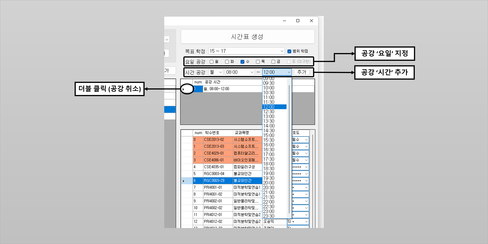

 

 

# TimeTable Generator - Beta2 (시간표 생성기)

 
 
 

 

### Beta2 업데이트 내역
1) 강의 리스트 개선
   - 카테고리(전공, 공통교양, 핵심교양 등) 선택 기능 추가
   - 필터(교과목명, 담당교수) 기능 추가

2) 학점 설정 개선
   - 범위형 학점 설정 기능 추가

3) 공강 설정 추가
   - 요일 공강 추가
   - 시간 공강 추가

4) 선호도 시스템 개선
   - 동일 교과목 여러 개를 추가했을 때의 처리 개선
      (Readme에 상세한 설명 첨부)
   - 필수 과목에 색상 강조 추가

5) 선택한 과목을 나타내는 UI개선
   - 정렬 이벤트 후 포커스가 맨 위로 고정되는 현상 개선
     이제는 포커스 위치가 유지

6) 시간표 개선
   - 강의 블록을 분 단위로 표현
     (기존: 30분 단위로 표현)
   - 강의 블록 가시성 개선
   - 강의 블록 선택 시 해당 강의정보를 나타내는 메시지 박스 생성

7) mDirms Reader모듈 구현
 

### 0. 실행 방법

 

### 1. 강의 목록 불러오기, 강의 선택 및 취소

 

### 2. 목표 학점 설정

 

### 3. 공강 설정

 

### 4. 강의 선호도 설정

 

### 5. 시간표 생성 및 확인

 
